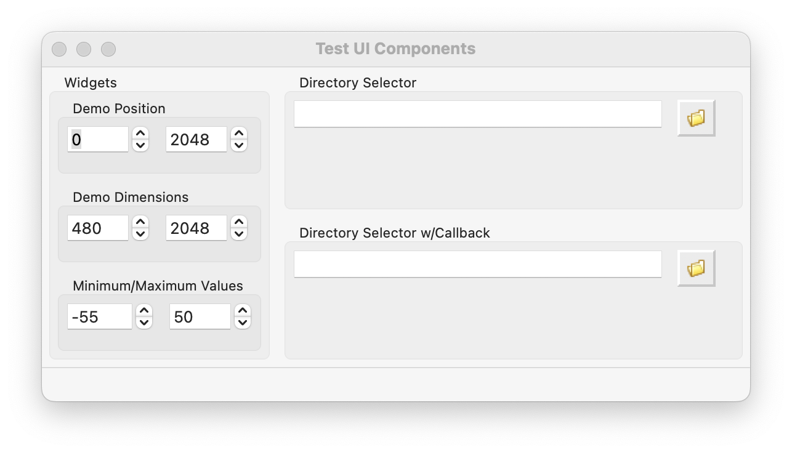
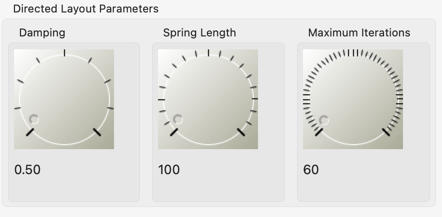

[](https://github.com/hasii2011/code-ally-advanced/actions/workflows/ci.yml)
[](https://badge.fury.io/py/codeallyadvanced)
[](https://github.com/hasii2011/code-ally-advanced/graphs/commit-activity)

[](https://www.python.org/)

Host common UI artifacts for various projects I am developing

___
Common wxPython UI artifacts for various projects I am developing

* Dimensions Control
* Position Control
* MinMax Control
* Directory Selector



* DialSelector

    

Written by <a href="mailto:email@humberto.a.sanchez.ii@gmail.com?subject=Hello Humberto">Humberto A. Sanchez II</a>  (C) 2025

## Note
For all kinds of problems, requests, enhancements, bug reports, etc., drop me an e-mail.

## Developer Notes
This project uses [buildlackey](https://github.com/hasii2011/buildlackey) for day-to-day development builds

Also notice that this project does not include a `requirements.txt` file.  All dependencies are listed in the `pyproject.toml` file.

#### Install the main project dependencies

```bash
pip install .
```

#### Install the test dependencies

```bash
pip install .[test]
```

#### Install the deploy dependencies

```bash
pip install .[deploy]
```

---
[Copilot Statement](https://github.com/hasii2011/code-ally-basic/wiki/GitHub-Copilot).
