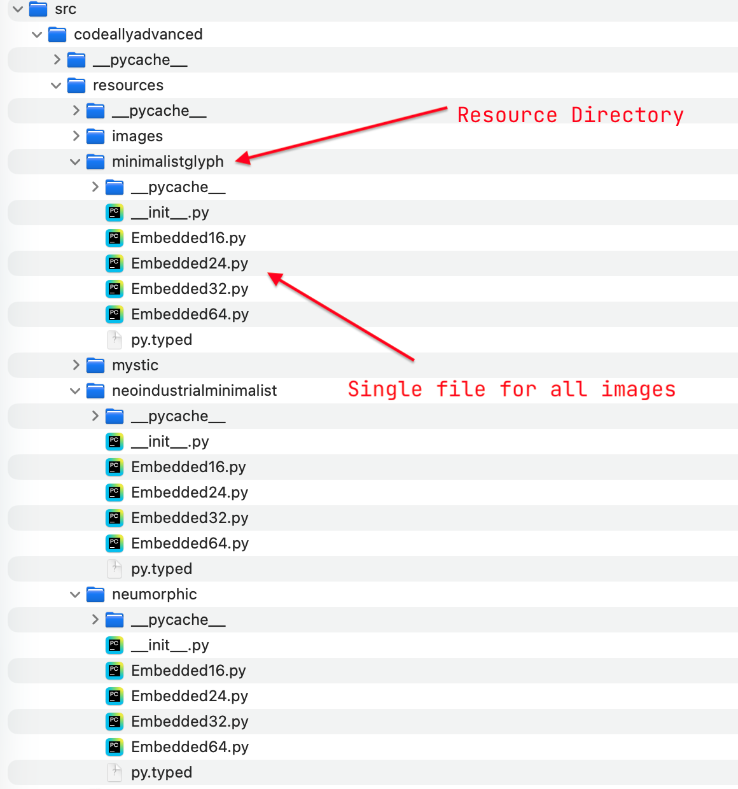

# How to Create the UmlDiagrammer Icons

Currently, we have 3 styles of toolbar icons for the UML Diagrammer.  We host them here so UML Diagrammer extensions can use them if they need them.

## resize.sh

This script creates the appropriate .png files from the source images.  It expects a relative directory name.  Currently, we have 3 styles of toolbar icons for the UML Diagrammer in the following directories:

-   minimalistglyph
-   neoindustrialminimalist
-   neumorphic

The source icons are 1280x1280 high-definition .png files for maximum resolution when we resize them for use.

The script creates .png files of the following sizes:

* 64x64
* 32x32
* 24x24
* 16x16

## toEmbedded.sh

Rather than embed binary resources in the UML Diagrammer, we use a wxPython feature that can turn bitmap files into Python code using the CLI `img2py`.  Each of the icons is represented as a `PyEmbeddedImage` data type.  I embed all of the images for a specific size in a single file.

This script creates the wxPython-consumable .py files for embedded images in a wxPython program.  The following is the resource directory organization:

